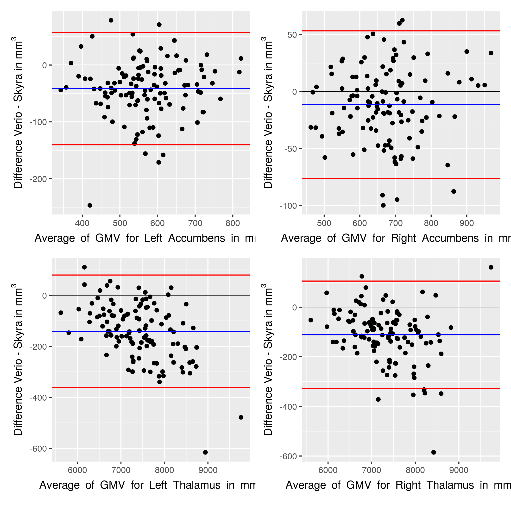

```{r "Package loading", include=FALSE}
library(lme4)
library(ggplot2)
library(haven)
library(plyr)
library(dplyr)
library(tidyr)
library(knitr)
library(psych)
library(psy)
library(boot)
library(MuMIn)
library(kableExtra)
library(patchwork)
library(lsr)
library(effsize)
library(pwr)
options(knitr.table.format = "latex") 
library(wesanderson)
library(cowplot)
source("icc_table.R")
source("create_long_table.R")
source("cnr_rh_table.R")
source("Bland_Altman.R")

knitr::opts_chunk$set(echo = FALSE, message=FALSE, warning=FALSE, fig.height=2, fig.width=4)

#put the path to this file here (working directory for Rmarkdown):
#opts_knit$set(root.dir = "./r")
```

```{r load fsbrain, echo=FALSE}
library(fsbrain)
atlas = 'aparc';
template_subject = 'fsaverage';
#put path to a FreeSurfer directory (or location of fsaverage template here)
template_subjects_dir = "/afs/cbs.mpg.de/software/freesurfer/6.0.0p1/ubuntu-bionic-amd64/subjects/"; #your FS directory
library('rgl');
r3dDefaults$windowRect=c(50, 50, 500, 500);

#makecmap_th = colorRampPalette(RColorBrewer::brewer.pal(9, name="YlOrRd"));
makecmap_pd = colorRampPalette(RColorBrewer::brewer.pal(9, name="RdBu"));
```
\newpage
# Abstract
Longitudinal imaging studies are crucial for advancing the understanding of brain development over the lifespan. Thus, more and more studies acquire imaging data at multiple time points or with long follow-up intervals. In these studies changes to magnetic resonance imaging (MRI) scanners often become inevitable which may decrease the reliability of the MRI assessments and introduce biases.
We therefore investigated the difference between MRI scanners with subsequent versions (3 Tesla Siemens Verio vs. Skyra) on the cortical and subcortical measures of grey matter in 116 healthy, young adults using the well-established longitudinal FreeSurfer stream for T1-weighted brain images. We found excellent between-scanner reliability for cortical and subcortical measures of grey matter structure (intra-class correlation coefficient > 0.8). Yet, paired t-tests revealed statistically significant differences in at least 67% of the regions, with percent differences around 2 to 4%, depending on the outcome measure. Offline correction for gradient distortions only slightly reduced these biases. Further, T1-imaging based quality measures reflecting gray-white matter contrast systematically differed between scanners.
We conclude that scanner upgrades during a longitudinal study introduce bias in measures of cortical and subcortical grey matter structure. Therefore, before upgrading a MRI scanner during an ongoing study, researchers should prepare to implement an appropriate correction method for these effects.

\newpage
# Introduction
Many longitudinal neuroimaging studies of aging and development investigate changes in local grey matter volume (GMV) over time to identify biomarkers relevant to health and disease. Notably, in the past decade many large-scale studies have implemented longitudinal designs in the general population (with at least two timepoints: [@bycroft2018uk; @ikram2015rotterdam], second timepoint currently being acquired: [@RN35; @bamberg2015]).   
Such longitudinal imaging studies assess within-subject differences and thereby benefit from reduction of error variance and confounding. Yet, scanner changes often become inevitable with long follow-up intervals (4-6 years) in these studies, entailing issues of reliability because of changes in signal-to-noise ratio or image intensity [@PREBOSKE20061196; @takao2010; @RN1331; @RN1334]. This is especially problematic in the case of two-visit longitudinal imaging studies where measurement occasion may be collinear with scanner upgrade, making it difficult to draw unbiased conclusions on within-subject change. In contrast, scanner upgrades will affect cross-sectional designs less as scanner version can be modelled like a site effect [@RN1323].   
Before the follow-up of the LIFE-Adult Study, a two-visit longitudinal imaging study with a long inter-visit interval (5-7 years), we had to decide on the upgrade of the study scanner from Verio to Skyra [@RN35]. At the time (end of 2017), most studies on the effects of scanner upgrades had investigated small samples (n<15) or voxel-based morphometry estimates of grey matter (GM) structure, with varying estimates of reliability and bias [@RN1328; @SHUTER2008371; @takao2013]. Thus, the impact of a scanner upgrade on region- and vertex-wise measures of cortical GM (thickness, area and volume) as well as subcortical GM volume still lacked quantification. Also, these studies did not take into account gradient distortion correction which has been shown to partly account for variation between scanners [@RN1326; @RN1321].  
Here, we therefore investigated the difference between scanners with subsequent versions (3 Tesla Verio vs. Skyra) on the cortical and subcortical measures of GM in a large sample of healthy, young adults. Differences between the systems included the changes introduced by software and hardware upgrades (update to syngo MR E11 software, a new Tim 4G body coil and installation of DirectRF) and side-specific variations in the scanner hardware.
Using the validated longitudinal FreeSurfer stream, we expected the reliability of whole-brain and regional GM measures to be similar to previous studies investigating between-site reliability [@RN1343; @RN1318; @RN1322]. Based on previous upgrade studies, we hypothesized a systematic bias with varying effect sizes and direction in cortical and subcortical regions [@RN1328; @RN1327]. Finally, we expected gradient distortion correction to improve reliability and reduce bias.


\newpage

# Methods

```{r Load data, include=FALSE}
#Because we are not allowed to share study IDs, we removed all IDs and replaced them with numbers. We share only already merged tables.

#for information on age, sex, duration between scans
qa_info=read.csv("data/qa_info.csv")
qdec_long=read.table(file = "data/qdec_long")
years=qdec_long$years[seq(2,length(qdec_long$years),2)]
med_months=round(12*median(years),2)
range_months=round(12*range(years),2)

#Main analysis (Verio ND vs. Skyra ND)
#for cortical measures from longitudinal FreeSurfer (CT/CA/CV)
aparc_ct=read.csv("data/aparc_ct_update.csv")
aparc_area=read.csv("data/aparc_area_update.csv")
aparc_volume=read.csv("data/aparc_volume_update.csv")

#for volumes from longitudinal FreeSurfer subcortical regions
vol=read.csv("data/aseg_update.csv")

#for QA measures from mriqc
qa=read.csv("data/mriqc_measures.csv")

#for distortion corrected data
#CT
aparc_unw=read.csv("data/aparc_ct_unw.csv")
#subcortical volumes
vol_unw=read.csv("data/vol_unw.csv")


aparc_veriond_skyrad=read.csv("data/aparc_ct_veriond_skyrad.csv")

```

## Sample  
`r nrow(qa_info)` healthy participants (median age = `r round(median(qa_info$Alter_aktuell),2)` years, range = `r round(range(qa_info$Alter_aktuell),2)[1]` - `r round(range(qa_info$Alter_aktuell),2)[2]` years; `r table(qa_info$Geschlecht)[3]` females) were scanned on two different 3 Tesla MRI scanners (MAGNETOM Verio syngo MR B17A (Siemens Healthcare, Erlangen, Germany), MAGNETOM Skyra fit syngo MR E11A (Siemens Healthcare, Erlangen, Germany). Scanners are referred to as Verio and Skyra throughout the manuscript. Due to a pending version upgrade of the Verio scanner, all participants were first scanned at the Verio and then at the Skyra scanner. The median time between sessions was `r round(med_months*4,1)` weeks (range: `r round(range_months[1]*4,1)` - `r round(4*range_months[2],1)` months).   
`r nrow(qa_info[qa_info$SKYRA..0.unscanned.1.scanned.==0,])` participants did only participate in the first scanning session at the Verio and were therefore excluded in the following analysis. The study was approved by the local ethics committee at the University of Leipzig and all participants gave written informed consent according to the Declaration of Helsinki.   

  ```{r Reminder of sample size, eval=FALSE}
there are 121 subjects, 5 do not have Skyra assessment -> 116.This means 232 scans in both qdec_long_table & in the fs_id for extraction of ROI values. 
```
## Differences between scanners and Image Acquisition
The upgrade from Verio to Skyra includes an extensive retrofit of hardware and software
components (e.g. new body coil, new RF transmit and receive signal transmission
system and change to syngo MR E11 software). For more information on the upgrade,
see the Siemens product brochure saved in https://github.com/fBeyer89/life_upgrade.
In this study, the Verio did not undergo an actual upgrade and the scanners therefore differed in the
main B0-field and other hardware components. See Table 1 for a summary of
differences between scanners.

| MRI scanner | MAGNETOM Verio | MAGNETOM Skyra fit|
| ----------- | ----------- |----------- |
| Nominal field strength  | 3 Tesla | 3 Tesla |
| System software version | syngo MR B17A | syngo MR E11C |
| Tx/Rx coil | Body coil: Tim Tx Trueform [102x32] 32-channel head coil | Body coil:Tim 4G [204x64] 32-channel head coil |
| Transmission amplifier reference amplitude (mean/standard deviation in V)   | 432/27.8 | 311/15.7 |
| Gradient system   | VQ Gradients 45 mT/m @ 200 T/m/s | VQ Gradients 45 mT/m @ 200 T/m/s |
| Coil combination algorithm   | adaptive coil combination | adaptive coil combination |
| Imaging sequence   | Vendor-implementation of MPRAGE with standardized parameters according to ADNI-3 | Vendor-implementation of MPRAGE with standardized parameters according to ADNI-3 |
| Parallel imaging method  | Grappa with iPAT: 2 | Grappa with iPAT: 2 |
| TE (ms)   | 2.98 | 2.98  |
| Acquisition time (min:sec)  | 5:10 | 5:10 |


On both scanners, anatomical T1-weighted imaging was performed with a magnetization-prepared rapid gradient-echo (MPRAGE) sequence (TR=2300 ms,TE=2.98 ms, TI=900 ms, parallel imaging: GRAPPA with factor 2 and adaptive coil combination, flip angle: 9°, imaging matrix 256 x 240 x 176 and voxel size= 1 $mm^{3}$, with prescan normalize option) according to the ADNI protocol [@RN500]. 

On the Skyra scanner, both online 3D gradient distortion-corrected images (D) and images not corrected for distortions (ND) were available. The Verio scanner delivered the images without gradient-distortion correction (ND).   
## Image Processing

### FreeSurfer analysis

To extract reliable volume and thickness estimates, we processed the T1-weighted images with the longitudinal stream in *FreeSurfer* [@RN1343]. Within this pipeline, an unbiased within-subject template space is created using robust and inverse consistent registration [@REUTER20101181;@REUTER201119]. The longitudinal stream increases the reliability of cortical and subcortical GM estimates compared to the cross-sectional stream and is thus appropriate for longitudinal studies [@RN1322]. We used *FreeSurfer* version 6.0.0p1 with the default parameters `recon-all -all -parallel -no-isrunning -openmp 8`, which include non-parametric non-uniform intensity normalization with the MINC tool `nu_correct`. 
We ran the `recon-all` longitudinal stream with Verio ND and Skyra ND images as input, and repeated the analysis with Verio ND and Skyra D images. 

### Gradient distortion correction
Gradient distortion correction has been shown to contribute to measurement error in repeated sessions of anatomical brain imaging [@takao2010]. Accordingly, correcting for distortion correction can improve the reproducibility of  intensity data significantly [@RN1326]. For the Verio  scanner, the vendor provided no online distortion correction while the Skyra system offered online 3D-distortion correction. To assess the effect of this processing step on reliability and bias, we applied an identical tool for offline gradient distortion correction on the ND sequences from both scanners.   
Gradient unwarping calculates the geometric displacement based on the spherical expansion of the magnetic gradient fields and applies it to the image [@glasser2013minimal;@RN1326]. We used the gradunwarp implementation [(https://github.com/Washington-University/gradunwarp)] v1.1.0 in Python 2.7. We visually compared the original and the `gradunwarp` result files to determine the appropriate number of sampling points and interpolation order. Based on this, we chose 200 sampling points and 4th order interpolation (`--fovmin -0.2 --fovmax 0.2 --numpoints 200 --interp_order 4`) because this yielded most similar intensity distributions. After unwarping, we repeated FreeSurfer's cross-sectional and longitudinal stream for these images. Then, we assessed the reliability and bias in cortical and subcortical ROI measures between the `gradunwarp` distortion corrected Skyra ND and Verio ND images.

### Outcomes  
We selected cortical thickness (CT), area (CA) and volume (CV) estimates for regions of interests defined by the Desikan-Killiany (DK) cortical parcellation (64 ROI for both hemispheres) as outcomes. Subcortical volumes were extracted from FreeSurfer's subcortical segmentation ("aseg.mgz", 18 bilateral ROI). We analyzed all ROI per hemisphere. Subcortical volumes were not adjusted for head size because during the longitudinal stream, both images are normalized to the same head size.


### Quality Assessment  
We visually checked the cross-sectional as well as the longitudinal runs for errors in white matter segmentation and misplaced pials [@RN1262].
There were `r nrow(qa_info[!is.na(qa_info$correction.necessary)&qa_info$correction.necessary==1,])` cases where the pial surface expanded into non-brain tissue. These were corrected by either editing the brainmask in the longitudinal template or by correcting the cross-sectional runs. After correction, we re-ran the longitudinal template creation step and the longitudinal timepoints. No issues regarding white matter segmentation were noticed.   
To quantify potential differences in image quality between scanners, we compared different quality control measures provided by `mriqc` (version 0.15.0) [@esteban2017mriqc]. We used signal-to-noise ratio (SNR) to assess overall signal qualiy and compared contrast-to-noise ratio (CNR) to quantify the difference between grey and white matter intensity distributions. Furthermore, we used coefficient of joint variation (CJV) which also reflects grey-to-white matter contrasts and entropy focus criterion (EFC) to describe the amount of ghosting and blurring induced by head motion [@esteban2017mriqc]. We performed `mriqc` on the Verio ND, Skyra ND and Skyra D images.


## Analysis  
In the main analysis, we compared Verio ND and Skyra ND as they correspond to the same stage of image reconstruction and are therefore most comparable. 
Additionally, we investigated the effects of offline `gradunwarp` distortion correction on Verio ND and Skyra ND images.
In a supplementary analysis, we compared Verio ND and Skyra D outcomes as these are the default reconstructions available at the respective scanners (see the diagram of the study flow in Figure \@ref(fig:overview)).
```{r overview, eval=FALSE, fig.cap="Overview of the acquisitions and the performed analyses. Orange: Main analysis comparing Verio ND and Skyra ND. Blue: Analysis of gradunwap Verio ND and Skyra ND. Green: Additional analysis of default scanner outputs Verio ND and Skyra D.",out.width="75%", fig.show='hold',fig.align='center'}
overview_figure=c("figures/Figure1.png")
knitr::include_graphics(overview_figure)
#out.width="49%", out.height="30%",
```
All statistical analysis were performed in R version 3.6.1 [@Rcore]. The package `fsbrain v.0.3.0` was used to plot vertex- and ROI-wise results [@fsbrain].
All scripts used for image processing, statistical analyses plotting as well as anonymized summary data to reproduce results are available on https://github.com/fBeyer89/life_upgrade. 

### Reliability and percent difference of cortical and subcortical GM measures
To assess the reliability of the grey matter (GM) estimates, we calculated the intra-class correlation coefficient (ICC), an established measure of agreement between raters. The ICC is calculated as the proportion of overall variance that is explained by between-subject variance, and thereby gives an estimate of the variance introduced by systematic differences and error between raters [@RN1344].
$$\rho_{3A} = \frac{\sigma_{r²}}{\sigma_{r²}+\Theta_{c²}+\sigma_{\nu²}}$$
Here, $\sigma_{r²}$ is the population variance, $\Theta_{c²}$ is the variance of fixed biases and $\sigma_{\nu²}$ is the error variance.
We used the two-way mixed effect ICC model for single measures with absolute agreement [@shrout1979intraclass], implemented in the package `psy` to calculate ICC for each cortical DK and subcortical ROI and reported the estimate and 95% confidence interval, derived by bootstrapping. According to [@cicchetti1994guidelines], we considered an ICC below .4 to be poor, between .40 and .59 to be fair; .60 and .74 to be good and between .75 and 1.00 to be excellent.   
ICC depends on the between-subject variance (i.e. when between-subject variance is low, ICC decreases even if rater bias remains similar) and does not provide an estimation of bias and difference between measurements. Therefore, we used Bland-Altman plots with 95% limits of agreement to visually compare the agreement between the two scanners [@bland1986statistical].  
To quantify the relative difference of GM measures between scanners, we calculated percent difference (PD) (also termed variability error [@RN1322; @RN1330]). We calculated the mean of the PD for each ROI  $j$ across $n$ participants according to
$$PD_{j} = \frac{2}{n}\sum\limits_{i=1}^{n}{\frac{V_{ij}-S_{ij}} {V_{ij}+S_{ij}}}$$
where $V_{ij}$ is the GM measure of a ROI measured on the Verio, $S_{ij}$ is the GM measure of a ROI measured on the Skyra.  
Finally, we performed paired t-tests to inform about the direction and statistical significance of potential systematic differences between scanners. Here, we used Benjamini-Hochberg correction to adjust p-values per cortical GM measure and deemed differences to be significant at $p_{adj}$ <0.05 [@RN200]. We reported T-value, uncorrected and corrected p-values.   
We assessed the improvement by comparing the ICC and PD measures of CT and subcortical volume between the gradient distortion correction analysis (gradunwarp Skyra ND, gradunwarp Verio N), the original analysis (Skyra ND, Verio ND) and the secondary analysis (Skyra D, Verio ND).

### Vertex-wise estimation of reliability and percent difference
For whole-brain visualization, we performed vertex-wise calculations on the fsaverage template following [@liem2015] in Matlab version 9.7 (2019b). We calculated ICC and PD for cortical thickness, area and volume to visualize reliability and difference between scanners on a vertex-wise level. 
<!-- To assess potential systematic over-or underestimation of cortical measures on the whole-brain level, we also performed paired-sample t-tests. -->

### Quality metrics
For the quality metrics from `mriqc`, we used linear mixed models (LMM) to assess differences between scanners (Verio, Skyra) and acquisitions (D, ND) using `lmerTest`. Significance was defined based on model comparisons (using Chi-square test with R's `anova`) between LMM including either scanner or acquisition as a fixed effect and null models only including the random effects of subject. Significance was defined as p < 0.05.   We also tested whether CNR was associated with regional CT, independent of scanner, using a LMM with both factors. We reported $\beta$ estimates, raw and Benjamini-Hochberg adjusted p-values.


### Data and Code availability
The minimal underlying dataset for the region-wise analyses in this manuscript is openly available (10.17617/3.6b). Moreover, the data and the corresponding code are available on github (https://github.com/fBeyer89/life_upgrade). Under certain conditions, the authors may also provide access to the whole-brain MRI data. 
\newpage

# Results 

## Differences in cortical GM measures between scanners

```{r create thickness table, echo=FALSE}
aparc_ct_l=create_long_table_aparc(aparc_ct,"thickness")
#---- calculate ICC and PD for FreeSurfer cortical thickness----
icc_res_th<-create_icc_table_aparc(aparc_ct_l)
colnames(icc_res_th)=c("ROI","hemi","ICC", "lower ICC", "upper ICC", "PD", "T", "p", "adj.p")
```
```{r cohensd thickness, echo=FALSE}
res_cohend_sf=cohen.d(aparc_ct_l[aparc_ct_l$scanner=="VERIO","superiorfrontal"],aparc_ct_l[aparc_ct_l$scanner=="SKYRA","superiorfrontal"], paired=TRUE)
res_power_sf=pwr.t.test(d=res_cohend_sf$estimate, power=0.8, sig.level=0.05, type="paired")
res_cohend_lo=cohen.d(aparc_ct_l[aparc_ct_l$scanner=="VERIO","lateraloccipital"],aparc_ct_l[aparc_ct_l$scanner=="SKYRA","lateraloccipital"], paired=TRUE)
res_power_lo=pwr.t.test(d=res_cohend_lo$estimate, power=0.8, sig.level=0.05, type="paired")
```

```{r create area table, echo=FALSE}
aparc_area_l=create_long_table_aparc(aparc_area, "area")
#---- calculate ICC and PD for FreeSurfer cortical area----
icc_res_area<-create_icc_table_aparc(aparc_area_l)
colnames(icc_res_area)=c("ROI","hemi","ICC", "lower ICC", "upper ICC", "PD", "T", "p", "adj.p")
```

```{r create volume table, echo=FALSE}
aparc_volume_l=create_long_table_aparc(aparc_volume,"volume")
#---- calculate ICC and PD for FreeSurfer cortical volume----
icc_res_vol<-create_icc_table_aparc(aparc_volume_l)
colnames(icc_res_vol)=c("ROI","hemi","ICC", "lower ICC", "upper ICC", "PD", "T", "p", "adj.p")
```

Figures \@ref(fig:plotthICCPD), \@ref(fig:plotareaICCPD) and \@ref(fig:plotvolICCPD) summarize the results for CT, CA and CV, respectively.

```{r prepare thickness ICC + PD plots, cache=TRUE, eval=FALSE}
lh_region_value_list=icc_res_th[icc_res_th$hemi=="lh","ICC"]
names(lh_region_value_list) = icc_res_th[icc_res_th$hemi=="lh","ROI"] 
rh_region_value_list=icc_res_th[icc_res_th$hemi=="rh","ICC"]
names(rh_region_value_list) = icc_res_th[icc_res_th$hemi=="rh","ROI"] 

vis.region.values.on.subject(template_subjects_dir, template_subject, atlas, lh_region_value_list, rh_region_value_list, views=c('t4'), draw_colorbar="horizontal",rglactions = list("snapshot_png"="icc_th.png"))

lh_region_value_list=icc_res_th[icc_res_th$hemi=="lh","PD"]
names(lh_region_value_list) = icc_res_th[icc_res_th$hemi=="lh","ROI"] 
rh_region_value_list=icc_res_th[icc_res_th$hemi=="rh","PD"]
names(rh_region_value_list) = icc_res_th[icc_res_th$hemi=="rh","ROI"] 
vis.region.values.on.subject(template_subjects_dir, template_subject, atlas,  rh_region_value_list,lh_region_value_list, views=c('t4'), draw_colorbar="horizontal",makecmap_options=list('colFn'=makecmap_pd,'symm'=TRUE), rglactions = list("snapshot_png"="pd_th.png"));
```

```{r plotthICCPD, echo=FALSE, out.width="49%", out.height="30%", fig.cap="left panel: CT ICC, right panel: CT PD (for each panel, left column shows lateral and medial view of right hemisphere, right column shows lateral and medial view of left hemisphere), negative values:Skyra>Verio, positive values: Verio>Skyra",fig.show='hold',fig.align='center'}
thickness_icc_pd=c("figures/thickness_icc.png","figures/thickness_pd.png")
knitr::include_graphics(thickness_icc_pd)
```

```{r prepare area ICC + PD plots, cache=TRUE, echo=FALSE}
#do not include this chunk now (because figures are done, as it opens RGL windows)
lh_region_value_list=icc_res_area[icc_res_area$hemi=="lh","ICC"]
names(lh_region_value_list) = icc_res_area[icc_res_area$hemi=="lh","ROI"] 
rh_region_value_list=icc_res_area[icc_res_area$hemi=="rh","ICC"]
names(rh_region_value_list) = icc_res_area[icc_res_area$hemi=="rh","ROI"] 

vis.region.values.on.subject(template_subjects_dir, template_subject, atlas, lh_region_value_list, rh_region_value_list, views=c('t4'), draw_colorbar="horizontal",
rglactions = list("snapshot_png"="icc_area.png"))#,makecmap_options=makecmap_pd

lh_region_value_list=icc_res_area[icc_res_area$hemi=="lh","PD"]
names(lh_region_value_list) = icc_res_area[icc_res_area$hemi=="lh","ROI"] 
rh_region_value_list=icc_res_area[icc_res_area$hemi=="rh","PD"]
names(rh_region_value_list) = icc_res_area[icc_res_area$hemi=="rh","ROI"] 
vis.region.values.on.subject(template_subjects_dir, template_subject, atlas, lh_region_value_list, rh_region_value_list, views=c('t4'), draw_colorbar="horizontal", rglactions = list("snapshot_png"="pd_area.png"),makecmap_options=list('colFn'=makecmap_pd,'symm'=TRUE));
```

```{r plotareaICCPD, echo=FALSE, out.width="49%", out.height="30%", fig.cap="left panel: CA ICC, right panel: CA PD (for each panel, left column shows lateral and medial view of right hemisphere, right column shows lateral and medial view of left hemisphere), negative values:Skyra>Verio, positive values: Verio>Skyra",fig.show='hold',fig.align='center'}
thickness_icc_pd=c("figures/area_icc.png","figures/area_pd.png")
knitr::include_graphics(thickness_icc_pd)
```

```{r prepare volume ICC + PD plots, cache=TRUE,echo=FALSE}
lh_region_value_list=icc_res_vol[icc_res_vol$hemi=="lh","ICC"]
names(lh_region_value_list) = icc_res_vol[icc_res_vol$hemi=="lh","ROI"] 
rh_region_value_list=icc_res_vol[icc_res_vol$hemi=="rh","ICC"]
names(rh_region_value_list) = icc_res_vol[icc_res_vol$hemi=="rh","ROI"] 

vis.region.values.on.subject(template_subjects_dir, template_subject, atlas, lh_region_value_list, rh_region_value_list, views=c('t4'), draw_colorbar="horizontal", rglactions = list("snapshot_png"="icc_vol.png"))

lh_region_value_list=icc_res_vol[icc_res_vol$hemi=="lh","PD"]
names(lh_region_value_list) = icc_res_vol[icc_res_vol$hemi=="lh","ROI"] 
rh_region_value_list=icc_res_vol[icc_res_vol$hemi=="rh","PD"]
names(rh_region_value_list) = icc_res_vol[icc_res_vol$hemi=="rh","ROI"] 
vis.region.values.on.subject(template_subjects_dir, template_subject, atlas, lh_region_value_list, rh_region_value_list, views=c('t4'), draw_colorbar="horizontal", rglactions = list("snapshot_png"="pd_vol.png"),makecmap_options=list('colFn'=makecmap_pd,'symm'=TRUE));
```

```{r plotvolICCPD, echo=FALSE, out.width="49%", out.height="30%", fig.cap="left panel: CV ICC, right panel: CV PD (for each panel, left column shows lateral and medial view of right hemisphere, right column shows lateral and medial view of left hemisphere), negative values:Skyra>Verio, positive values: Verio>Skyra",fig.show='hold',fig.align='center'}
thickness_icc_pd=c("figures/volume_icc.png","figures/volume_pd.png")
knitr::include_graphics(thickness_icc_pd)
```

 Overall, the ICC or scan-rescan reliability was excellent (CT: mean=`r round(mean(icc_res_th$ICC),2)`, min=`r round(min(icc_res_th$ICC),2)`, max=`r round(max(icc_res_th$ICC),2)`; CA: mean=`r round(mean(icc_res_area$ICC),2)`, min=`r round(min(icc_res_area$ICC),2)`, max=`r round(max(icc_res_area$ICC),2)`; CV: mean=`r round(mean(icc_res_vol$ICC),2)`, min=`r round(min(icc_res_vol$ICC),2)`, max=`r round(max(icc_res_vol$ICC),2)`).   
The PD was around 2-3% for all measures (CT: mean=`r round(mean(icc_res_th$PD),2)`, min=`r round(min(icc_res_th$PD),2)`, max=`r round(max(icc_res_th$PD),2)`; CA: mean=`r round(mean(icc_res_area$PD),2)`, min=`r round(min(icc_res_area$PD),2)`, max=`r round(max(icc_res_area$PD),2)`; CV: mean=`r round(mean(icc_res_vol$PD),2)`, min=`r round(min(icc_res_vol$PD),2)`, max=`r round(max(icc_res_vol$PD),2)`) with a significant bias. 
The most pronounced bias was found for CT, with lower CT in Verio compared to Skyra in medial frontal and central regions, and higher values in Verio compared to Skyra in lateral occipital and inferior temporal regions. For CA and CV, the bias pattern was more related to gyrification, with higher CA/CV for Skyra compared to Verio in sulci, and the reverse pattern in gyri (see Figure \@ref(fig:inflated_pd_maps)). Overall, the CT bias followed an medial-frontal to lateral-occipital pattern, and CA and CV differed between gyral-sulcal areas.

```{r inflatedpdmaps, echo=FALSE, eval=TRUE,out.width="30%", out.height="30%", fig.cap="PD for volume, area and thickness shown on inflated fsaverage subject",fig.show='hold',fig.align='center'}
knitr::include_graphics(c("figures/thickness_sm10_pd.png", "figures/area_sm10_pd.png", "figures/volume_sm10_pd.png"))
```
```{r create bland-altman_cortical, eval=TRUE, echo=FALSE}
r1=create_bland_altman_cort(aparc_ct_l, "CT", "lh", "superiorfrontal")
r1_rh=create_bland_altman_cort(aparc_ct_l, "CT", "rh", "superiorfrontal")
r2=create_bland_altman_cort(aparc_area_l, "CA", "lh", "superiorfrontal")
r2_rh=create_bland_altman_cort(aparc_area_l, "CA", "rh", "superiorfrontal")
r3=create_bland_altman_cort(aparc_volume_l, "CV", "lh", "superiorfrontal")
r3_rh=create_bland_altman_cort(aparc_volume_l, "CV", "rh", "superiorfrontal")
r4=create_bland_altman_cort(aparc_ct_l, "CT", "lh", "lateraloccipital")
r5=create_bland_altman_cort(aparc_area_l, "CA", "lh", "lateraloccipital")
r4_rh=create_bland_altman_cort(aparc_ct_l, "CT", "rh", "lateraloccipital")
r5_rh=create_bland_altman_cort(aparc_area_l, "CA", "rh", "lateraloccipital")
r6=create_bland_altman_cort(aparc_volume_l, "CV", "lh", "lateraloccipital")
r6_rh=create_bland_altman_cort(aparc_volume_l, "CV", "rh", "lateraloccipital")
```

Bland-Altman plots confirmed the bias of Verio versus Skyra measurements. Exemplary plots of superior frontal and lateral occipital regions are shown in Figure \@ref(fig:blandaltmancortical). 
```{r blandaltmancortical, echo=FALSE, fig.cap="Bland Altman plot showing differences of Verio Skyra against means for superior frontal (left column) and lateral occipital cortex (right column) of the left hemisphere. Top row shows cortical thickness, middle row shows cortical area and bottom row shows cortical volume. Limits of agreement at 95\\% of standard deviation",fig.show='hold',fig.align='center'}
cortba=c("figures/Cort_BA.png")
knitr::include_graphics(cortba)
```
For the superior frontal region, CT, CA and CV are larger for Skyra compared to Verio with 95% of CT differences were between `r round((r1_rh[[2]]+r1[[2]])/2,2)` and `r round((r1_rh[[3]]+r1[[3]])/2,2)` mm,  95% of CA differences were between `r round((r2_rh[[2]]+r2[[2]])/2,2)` and `r round((r2_rh[[3]]+r2[[3]])/2,2)` $mm^2$, and 95% of CV differences were between `r round((r3_rh[[2]]+r3[[2]])/2,2)` and `r round((r3_rh[[3]]+r3[[3]])/2,2)` $mm^3$. The inverse pattern was present in the lateral occipital region with 95% of CT differences were between `r round((r4_rh[[2]]+r4[[2]])/2,2)` and `r round((r4_rh[[3]]+r4[[3]])/2,2)` $mm$,  95% of CA differences were between `r round((r5_rh[[2]]+r5[[2]])/2,2)` and `r round((r5_rh[[3]]+r5[[3]])/2,2)` $mm^2$, and 95% of CV differences were between `r round((r6_rh[[2]]+r6[[2]])/2,2)` and `r round((r6_rh[[3]]+r6[[3]])/2,2)` $mm^3$.
Accordingly, paired t-tests indicated systematic differences between scanners for the majority of regions of interest (FDR-corrected, CT: `r round((nrow(icc_res_th[icc_res_th$p<0.05,])*100/64),1)`% of all 64 bilateral ROI, CA: `r round((nrow(icc_res_area[icc_res_area$p<0.05,])*100/64),1)`%, CV: `r round((nrow(icc_res_vol[icc_res_vol$p<0.05,])*100/64),1)`%).   
For detailed results per cortical region see Tables 1.1, 2.1 and 3.1 in the Supplementary Material. 

## Differences in subcortical measures between scanners
```{r create subcort table, echo=FALSE}
vol_l=create_long_table_subcort(vol)
icc_res_vol<-create_icc_table_vol(vol_l)
colnames(icc_res_vol)=c("ROI","hemi","ICC", "lower ICC", "upper ICC", "PD", "T", "p", "adj.p")
```

```{r tab4subcort, echo=FALSE}
vol_table=
icc_res_vol %>%
   mutate(
     adj.p = cell_spec(adj.p, "latex", bold = ifelse(adj.p < 0.05, T, F))
   )  %>%
  #select(p_adjust) %>%
  kable("latex", escape = F, caption="Reliability and percent differences for subcortical volumes") %>%
  kable_styling(bootstrap_options = c("striped", "hover"))
vol_table
```

As shown in Table \@ref(tab:tab4subcort), subcortical regions, similar to cortical areas, showed excellent reliability for all regions of interest (mean=`r round(mean(icc_res_vol$ICC),2)`, min=`r round(min(icc_res_vol$ICC),2)`, max=`r round(max(icc_res_vol$ICC),2)`). 
The PD was around 2-3% (mean=`r round(mean(icc_res_vol$PD),2)`%, min=`r round(min(icc_res_vol$PD),2)`%, max=`r round(max(icc_res_vol$PD),2)`%), with an outlying PD of 9.5% for left Accumbens. Higher values were measured on Skyra compared to Verio for all regions, and these were significant for most regions (FDR-corrected, `r round((nrow(icc_res_vol[icc_res_vol$p<0.05,])*100/14),1)`% of all 14 bilateral ROI).
```{r blandaltmansubcortial, eval=TRUE, echo=FALSE}
r1=create_bland_altman_subcort(vol_l, "Left", "Accumbens")
r2=create_bland_altman_subcort(vol_l, "Right", "Accumbens")
r3=create_bland_altman_subcort(vol_l, "Left", "Thalamus")
r4=create_bland_altman_subcort(vol_l, "Right", "Thalamus")
```

```{r blandaltmansubcorticalplot, eval=TRUE, echo=FALSE, fig.cap="Bland-Altman plot showing differences of Verio-Skyra against means for Accumbens (top row) and Thalamus (bottom row). Limits of agreement at 95\\% of standard deviation",fig.show='hold',fig.align='center'}

```
Bland-Altman plots for subcortical regions confirmed the systematic bias and further indicated that differences in variability between subjects influenced ICC estimates. For example, there was high between-subject variability in the Thalamus, so that, despite large differences between measurements, ICC was high. Similarly, differences between scanners were less pronounced in the Accumbens, yet, due to lower between-subject variability the ICC of this region was lower (see Figure \@ref(fig:blandaltmansubcorticalplot), and supplementary Figure 5). For the Accumbens, 95% of differences between scanners were between `r round((r1[[3]]+r2[[3]])/2,2)` and `r round((r1[[4]]+r2[[4]])/2,2)` $mm^3$, for Thalamus 95% of differences were between `r round((r3[[3]]+r4[[3]])/2,2)` and `r round((r3[[4]]+r4[[4]])/2,2)` $mm^3$. 

## QA measures
First, we compared SNR, CNR, CJV and EFC, three quality measures from [mriqc](https://mriqc.readthedocs.io) between Verio ND and Skyra ND acquisitions. We aimed to determine whether differences in basic signal properties might underlie the observed differences in measures of GM structure.   
```{r create QA measures table, echo=FALSE}
for (i in 1:nrow(qa)){
  #print(i)
  #print(qa[i,1])
  tmp=strsplit(toString(qa[i,1]),'_')[[1]]
  #print(tmp)
  qa[i,"subj"]=tmp[1]
  qa[i,"scanner"]=tmp[2]
  qa[i,"acq"]=tmp[3]
}

qa$Scanner=as.factor(qa$scanner)
levels(qa$Scanner)=c("Skyra","Verio")
qa$Acquisition=as.factor(qa$acq)
levels(qa$Acquisition)=c("D","ND")

```

```{r calculate differences between scanners, echo=FALSE}
#compare Verio -ND with Skyra -ND
res_snr=lmer(snr_total ~ scanner + (1|subj), data=qa[!(qa$scanner=="ses-SKYRA"&qa$acq=="acq-D"),]) 
null_snr=lmer(snr_total ~ (1|subj), data=qa[!(qa$scanner=="ses-SKYRA"&qa$acq=="acq-D"),])
anov_snr=anova(res_snr,null_snr)
p_snr=anov_snr$`Pr(>Chisq)`[2]

res_cnr=lmer(cnr ~ scanner + (1|subj), data=qa[!(qa$scanner=="ses-SKYRA"&qa$acq=="acq-D"),]) 
null_cnr=lmer(cnr ~ (1|subj), data=qa[!(qa$scanner=="ses-SKYRA"&qa$acq=="acq-D"),])
anov_cnr=anova(res_cnr,null_cnr)
p_cnr=anov_cnr$`Pr(>Chisq)`[2]

res_efc=lmer(efc ~ scanner + (1|subj), data=qa[!(qa$scanner=="ses-SKYRA"&qa$acq=="acq-D"),]) 
null_efc=lmer(efc ~ (1|subj), data=qa[!(qa$scanner=="ses-SKYRA"&qa$acq=="acq-D"),])
anov_efc=anova(res_efc,null_efc)
p_efc=anov_efc$`Pr(>Chisq)`[2]

res_cjv=lmer(cjv ~ scanner + (1|subj), data=qa[!(qa$scanner=="ses-SKYRA"&qa$acq=="acq-D"),]) 
null_cjv=lmer(cjv ~ (1|subj), data=qa[!(qa$scanner=="ses-SKYRA"&qa$acq=="acq-D"),])
anov_cjv=anova(res_cjv,null_cjv)
p_cjv=anov_cjv$`Pr(>Chisq)`[2]
```

```{r plotqadiff, fig.cap="Quality metrics (CNR (left panel), EFC (middle panel) and CJV (right panel)) compared between Skyra ND (orange) and Verio ND (yellow) acquisitions, showing overall higher data quality on the Verio scanner", fig.show='hold',fig.align='center', fig.width=9, fig.height=4, echo=FALSE}
tspag_snr = ggplot(qa[!(qa$scanner=="ses-SKYRA"&qa$acq=="acq-D"),], aes(x=Scanner, y=snr_total, fill =Scanner)) + 
  geom_boxplot()+
  xlab(bquote("Scanner")) + 
  ylab(bquote('SNR')) + 
  scale_fill_manual(values=wes_palette("FantasticFox1",2,type="discrete")) +
  theme(axis.text=element_text(size=10),
  axis.title=element_text(size=12),
  strip.text = element_text(size=12),
  legend.position="")

tspag_cnr = ggplot(qa[!(qa$scanner=="ses-SKYRA"&qa$acq=="acq-D"),], aes(x=Scanner, y=cnr, fill =Scanner)) + 
  geom_boxplot()+
  xlab(bquote("Scanner")) + 
  ylab(bquote('CNR')) + 
  scale_fill_manual(values=wes_palette("FantasticFox1",2,type="discrete")) +
  theme(axis.text=element_text(size=10),
  axis.title=element_text(size=12),
  strip.text = element_text(size=12),
  legend.position="")

tspag_efc = ggplot(qa[!(qa$scanner=="ses-SKYRA"&qa$acq=="acq-D"),], aes(x=Scanner, y=efc, fill=Scanner, group=Scanner)) +   geom_boxplot() + 
  xlab(bquote("Scanner")) + 
  ylab(bquote('EFC')) +
  scale_fill_manual(values=wes_palette("FantasticFox1",2,type="discrete")) +
  theme(axis.text=element_text(size=10),
  axis.title=element_text(size=12),
  strip.text = element_text(size=12),
  legend.position="")

tspag_cjv = ggplot(qa[!(qa$scanner=="ses-SKYRA"&qa$acq=="acq-D"),], aes(x=Scanner, y=cjv, fill=Scanner, group=Scanner)) +   geom_boxplot() + 
  xlab(bquote("Scanner")) + 
  ylab(bquote('CJV'))  + 
  scale_fill_manual(values=wes_palette("FantasticFox1",2,type="discrete")) +
  theme(axis.text=element_text(size=10),
  axis.title=element_text(size=12),
  strip.text = element_text(size=12),
  legend.position="right")

pl1=(tspag_snr|tspag_cnr)/(tspag_efc|tspag_cjv)
pl1
```
We found that there was no significant difference in SNR between Verio and Skyra ($\beta$=`r round(fixef(res_snr)[2],2)`, p = `r round(p_snr,2)`). Yet, Verio ND T1-weighted images had higher CNR ($\beta$=`r round(fixef(res_cnr)[2],2)`, p < 0.001 ), lower EFC ($\beta$= `r round(fixef(res_efc)[2],2)`, p < 0.001) and lower CJV ($\beta$=`r round(fixef(res_cjv)[2],2)`, p < 0.001) compared to Skyra ND images, also see Figure \@ref(fig:plotqadiff). This indicates higher contrast between WM and GM and less blurring on the Verio scanner.
Similar to [@SHUTER2008371], we investigated whether increased CNR would predict differences in CT. Here, we found that higher CNR across both scanners was associated with higher CT for most regions (see Figure \@ref(fig:plotcnrct), left panel). Moreover, scanner predicted CT independent of CNR in the same regions as shown above (see Figure \@ref(fig:plotcnrct), right panel, and Table 4.1 in the Supplementary Material).   
  
```{r plotcnrct, echo=FALSE,eval=FALSE, out.width="49%", out.height="30%", fig.cap="Association of CNR (left panel) and scanner (right panel, negative values indicate Skyra>Verio) with cortical thickness, shown as coefficients from a linear mixed model including both terms. Left column shows lateral and medial view of left hemisphere, right column shows lateral and medial view of right hemisphere",fig.show='hold',fig.align='center'}
cnr_ct=c("figures/cnr_thickness.png","figures/scanner_thickness.png")
knitr::include_graphics(cnr_ct)
```
Figure \@ref(fig:exempleregionscnrCT) shows the association of CNR and CT for two exemplary regions with contrary scanner effects (superior frontal and lateral occipital).


```{r exempleregionscnrCT, echo=FALSE, out.width="49%", out.height="30%", fig.cap="Association of CNR and cortical thickness in left superior frontal and lateral occipital cortex",fig.show='hold',fig.align='center'}
latocc_supfr=c("figures/supfrontal_withROI.png","figures/latocc_withROI.png")
knitr::include_graphics(latocc_supfr)
```

## Effect of offline gradient distortion correction
We examined whether the differences in cortical and subcortical GM measures arise from the difference in gradient distortion between the two scanners. We corrected both ND files using vendor-provided information on gradient distortions with `gradunwarp`. 
```{r create unwarped thickness table, echo=FALSE}
#there is none complete data for some subjects, which are probably running right now.
aparc_ct_l=create_long_table_aparc(aparc_unw, "thickness")

#---- calculate ICC and PD for FreeSurfer cortical thickness----
icc_res_th_unw<-create_icc_table_aparc(aparc_ct_l)
colnames(icc_res_th_unw)=c("ROI","hemi","ICC", "lower ICC", "upper ICC", "PD", "T", "p", "adj.p")
```

```{r prepare unwarped thickness ICC + PD plots, cache=TRUE, echo=FALSE}
lh_region_value_list=icc_res_th_unw[icc_res_th_unw$hemi=="lh","ICC"]
names(lh_region_value_list) = icc_res_th_unw[icc_res_th_unw$hemi=="lh","ROI"] 
rh_region_value_list=icc_res_th_unw[icc_res_th_unw$hemi=="rh","ICC"]
names(rh_region_value_list) = icc_res_th_unw[icc_res_th_unw$hemi=="rh","ROI"] 

vis.region.values.on.subject(template_subjects_dir, template_subject, atlas, lh_region_value_list, rh_region_value_list, views=c('t4'), draw_colorbar="horizontal",rglactions = list("snapshot_png"="icc_th_unwarped.png"))

lh_region_value_list=icc_res_th_unw[icc_res_th_unw$hemi=="lh","PD"]
names(lh_region_value_list) = icc_res_th_unw[icc_res_th_unw$hemi=="lh","ROI"] 
rh_region_value_list=icc_res_th_unw[icc_res_th_unw$hemi=="rh","PD"]
names(rh_region_value_list) = icc_res_th_unw[icc_res_th_unw$hemi=="rh","ROI"] 
vis.region.values.on.subject(template_subjects_dir, template_subject, atlas,  rh_region_value_list,lh_region_value_list, views=c('t4'), draw_colorbar="horizontal",makecmap_options=list('colFn'=makecmap_pd,'symm'=TRUE), rglactions = list("snapshot_png"="pd_th_unwarped.png"));
```

```{r plotthICCPDunwarped, echo=FALSE, out.width="49%", out.height="30%", fig.cap="Comparison of CT results from gradunwarp-corrected data. Left panel: CT ICC, right panel: CT PD (for each panel, left column shows lateral and medial view of right hemisphere, right column shows lateral and medial view of left hemisphere), negative values:Skyra>Verio, positive values: Verio>Skyra",fig.show='hold',fig.align='center'}
thickness_icc_pd_unw=c("figures/thickness_icc_unwarped.png","figures/thickness_pd_unwarped.png")
knitr::include_graphics(thickness_icc_pd_unw)
```
```{r create former main (skyra_d vs verio_nd) thickness table, echo=FALSE}
#there is none complete data for some subjects, which are probably running right now.
aparc_ct_l=create_long_table_aparc(aparc_veriond_skyrad, "thickness")

#---- calculate ICC and PD for FreeSurfer cortical thickness----
icc_res_th_main<-create_icc_table_aparc(aparc_ct_l)
colnames(icc_res_th_main)=c("ROI","hemi","ICC", "lower ICC", "upper ICC", "PD", "T", "p", "adj.p")
```


```{r compare ICC and PD between normal & unwarped & main, echo=FALSE}
t_res=t.test(icc_res_th$ICC, icc_res_th_unw$ICC, paired=TRUE)
mean_ct=mean(icc_res_th$ICC)
mean_ct_unw=mean(icc_res_th_unw$ICC)
mean_ct_main=mean(icc_res_th_main$ICC)

t_res_pd=t.test(abs(icc_res_th$PD), abs(icc_res_th_unw$PD), paired=TRUE)
mean_pd_ct=mean(abs(icc_res_th$PD))
mean_pd_ct_unw=mean(abs(icc_res_th_unw$PD))

#F-TEST
val=c(icc_res_th$ICC, icc_res_th_unw$ICC, icc_res_th_main$ICC)
cond=rep(c("nd_nd","unw","main"),each=68)
ftest_frame=data.frame(val,cond)
res_aov=aov(val~cond, ftest_frame)
#`r round(mean(t_res$p.value),3)`
#`r round(mean(t_res_pd$p.value),2)`
```
Figure \@ref(fig:plotthICCPDunwarped) shows the results for CT derived from the `gradunwarp` distortion corrected data (also see Table 5.1 in the Supplementary Material).  The ICC was excellent throughout all ROI (mean= `r round(mean(icc_res_th_unw$ICC),2)`, min=`r round(min(icc_res_th_unw$ICC),2)`, max=`r round(max(icc_res_th_unw$ICC),2)`), and as expected, it was higher for the gradient distortion corrected data compared to the previous analysis of Verio ND vs Skyra ND (mean ICC `gradunwarp` Skyra D vs Verio D: `r round(mean_ct_unw,3)`, mean ICC Skyra ND vs Verio ND: `r round(mean_ct,3)`,  paired t-test: T = `r round(mean(t_res$statistic),2)`, p `r round(t_res$p.value,3)`).     
Gradient distortion correction reduced PD to 1-2% (mean=`r round(mean(icc_res_th_unw$PD),2)`%, min=`r round(min(icc_res_th_unw$PD),2)`%, max=`r round(max(icc_res_th_unw$PD),2)`), which was significant compared to ND data (mean PD `gradunwarp` Skyra D vs Verio D: `r round(mean_pd_ct_unw,2)`, mean PD Skyra ND vs Verio ND: `r round(mean_pd_ct,2)`, paired t-test: T = `r round(mean(t_res_pd$statistic),2)`, p = `r round(mean(t_res_pd$p.value),3)`). Yet,the inferior-superior pattern of biases remained similar, and there were still significant differences after `gradunwarp` for the majority of regions of interest (FDR-corrected, `r round((nrow(icc_res_th_unw[icc_res_th_unw$p<0.05,])*100/64),1)`% of 64 bilateral cortical ROI). 
In addition, we saw that the systematic bias was largest when comparing the default scanner output images Skyra D (online gradient distortion correction) and Verio ND (mean ICC `gradunwarp` Skyra D vs Verio D: `r round(mean_ct_unw,2)`, mean ICC Skyra ND vs Verio ND: `r round(mean_ct,2)`, mean ICC Skyra D vs Verio ND: `r round(mean_ct_main,2)`, ANOVA F-test: F = 3.7, p = 0.026). 

```{r create subcort table unwarped, echo=FALSE}
vol_l=create_long_table_subcort(vol_unw)
icc_res_vol_unw<-create_icc_table_vol(vol_l)
colnames(icc_res_vol_unw)=c("ROI","hemi","ICC", "lower ICC", "upper ICC","PD", "T","p", "adj.p")
```

```{r tab6volunwarped, echo=FALSE}
table_vol_unw=
icc_res_vol_unw %>%
   mutate(
     adj.p = cell_spec(adj.p, "latex", bold = ifelse(adj.p < 0.05, T, F))
   )  %>%
  #select(p_adjust) %>%
  kable("latex", escape = F, caption="Reliability and percent difference for subcortical volumes from gradient non-linearity corrected data (T<0 reflects Skyra >Verio , T>0 reflects Verio >Skyra )") %>%
  kable_styling(bootstrap_options = c("striped", "hover"))
table_vol_unw
```
  
```{r compare subcort volume ICC and PD between normal & unwarped, echo=FALSE}
t_res=t.test(icc_res_vol$ICC, icc_res_vol_unw$ICC, paired=TRUE)
mean_ct=mean(icc_res_vol$ICC)
mean_ct_unw=mean(icc_res_vol_unw$ICC)

t_res_pd=t.test(abs(icc_res_vol$PD), abs(icc_res_vol_unw$PD), paired=TRUE)
mean_pd_ct=mean(abs(icc_res_vol$PD))
mean_pd_ct_unw=mean(abs(icc_res_vol_unw$PD))
```  
Table \@ref(tab:tab6volunwarped) shows the results for subcortical volumes derived from the gradient distortion corrected data.  
The ICC is excellent in all regions, similar to the cortical analysis (mean=`r round(mean(icc_res_vol_unw$ICC),2)`, min=`r round(min(icc_res_vol_unw$ICC),2)`, max=`r round(max(icc_res_vol_unw$ICC),2)`). For subcortical volumes, gradient distortion correction did not lead to a further improvement in ICC (mean ICC `gradunwarp` Skyra D vs Verio D = `r round(mean_ct_unw,2)`, mean ICC Skyra ND vs Verio ND = `r round(mean_ct,2)`,  paired t-test: T = `r round(mean(t_res$statistic),2)`, p= `r round(mean(t_res$p.value),2)`).    
The PD was around 2-3% (mean=`r round(mean(icc_res_vol_unw$PD),2)`%, min=`r round(min(icc_res_vol_unw$PD),2)`%, max=`r round(max(icc_res_vol_unw$PD),2)`%) and did not differ from the original analysis (mean PD `gradunwarp` Skyra ND vs Verio ND = `r round(mean_pd_ct_unw,2)`%, mean PD Skyra ND vs Verio ND = `r round(mean_pd_ct,2)`%, paired t-test: T= `r round(mean(t_res_pd$statistic),2)`, p= `r round(mean(t_res_pd$p.value),2)`). There were significant differences after `gradunwarp` for all regions of interest (FDR-corrected, `r round((nrow(icc_res_vol_unw[icc_res_vol_unw$p<0.05,])*100/14),2)`% of 14 bilateral subcortical regions). 
\newpage


# Discussion
**Summary**  
In this paper, we aimed to investigate the reliability and bias in GM structure induced by a scanner upgrade in a longitudinal study. We compared outcomes of FreeSurfer's longitudinal pipeline between two different MRI scanners with subsequent versions.
We found between-scanner reliability measured with ICC to be excellent. Yet, Bland-Altman plots and paired t-tests revealed statistically significant differences, i.e. biases, in cortical thickness and subcortical GM volumes, as well as for cortical area and volume in a large number of regions. Offline correction for gradient distortions based on vendor-provided gradient information reduced this bias significantly, yet it was not fully removed. T1-imaging based quality measures differed systematically between scanners, also when adjusting for gradient distortions.  We conclude that scanner upgrades during a longitudinal study introduce bias in measures of cortical and subcortical grey matter structure and make it difficult to detect true effects when these are subtle like in the case of healthy aging, e.g. ~ 1% annual hippocampal volume loss in older healthy adults [@Fraser2015]. Therefore, before upgrading a MRI system during an ongoing longitudinal study, researchers should prepare to implement an appropriate correction method, such as deriving scaling factors from repeated measures before/after the upgrade or statistical adjustment methods.

**Comparison to previous reliability studies**   
The results of our study are in line with previous findings which have indicated systematic effects of scanner upgrade on GM imaging outcomes [@RN1336; @RN1327; @RN1328; @RN1339].      
In recent studies, scanner upgrades induced a significant bias in cortical and subcortical GM measures, while in one study, no systematic bias was reported for hippocampus volume [@potvin2019; @plitman2020impact; @Brown_2020].  Similar to our findings, ICC values for cortical measures were good to excellent. While the size of biases was comparable to our results (around 1-6% for cortical PD for CV and CT in [@potvin2019]), the location of the biased regions was different. 
In [@potvin2019; @plitman2020impact] GM estimates in prefrontal and temporal regions increased with the upgrade, which might be driven by upgrade-related increases in SNR in these regions, which typically show relatively poor within-subject reliability [@liem2015; @RN1330]. 
In our study, we found a medial-frontal to lateral-occipital gradient, with medial-frontal CT as well as subcortical volumes biased towards higher CT and GM volume in Skyra compared to Verio, while lateral-occipital CT was higher in Verio. For CA and CV we saw a gyrification dependent pattern, with higher CA and CV in sulci for Verio compared to Skyra, and higher CA and CV in gyri for Skyra compared to Verio. These pattern also shaped the ICC estimates. 
Image quality differed between the scanners, yet in contrast to previous studies, we found higher image quality on the (older) Verio scanner [@potvin2019; @plitman2020impact]. *Some words why we may see this*. Still, while we found higher CNR to be associated with higher CT, the CT bias pattern was independent of differences in global measures of image quality [@SHUTER2008371;@potvin2019].  
Similarly, while gradient distortion correction reduced the bias and increased reliability for cortical measures, the overall medial-frontal to lateral-occipital bias in CT and the gyrification-dependent pattern in CA and CV remained similar. Thus, while gradient distortions impact the reliability of GM estimates, they do not fully explain the bias between Skyra and Verio scanner.
<!-- This is in line with previous studies showing that gradient distortion correction may account for 16% of the image intensity relative error, remove site‐related variations to <1% and increase reliability of the between-site scans to within-site level was different between acquisitions in the main analysis [@RN1326; @RN1321].   -->
Instead, we speculate that differences in scaling or signal intensities, e.g. between white and gray matter, have led to the observed differences [@Clarkson_2009]. This would be compatible with the fronto-medial to occipital-lateral bias pattern (medial and subcortical regions biased toward higher CT and GM volume in Skyra compared to Verio) and the bias following the gyrification in CA. Upon visual inspections of the longitudinal runs (i.e. when both had been registered to a common template), we noticed a subtle expansion of the brain in Skyra compared to Verio for some exemplary subjects. 
Taken together, we believe the systematic biases between Verio and Skyra stem from both scaling and image intensity differences, and were strongly related to scanner hardware.  
While our results certainly overestimate the effects of a real upgrade as discussed above, they still support previous studies on the biasing effects of a scanner upgrade and urge for the use of an adequate correction method if an upgrade becomes necessary during a longitudinal study.  One possibility is to measure the same subjects shortly before and after the upgrade and to derive scaling factors like in [@RN1318]. Another possibility, which does not require additional data acquisition, is longitudinal ComBat correction, which takes into account biased mean and scaling due to systematic scanner differences [@BEER2020117129] or the use of a deep-learning-based harmonisation framework [@Dinsdale_2021].


**Limitations**   
The main limitation of our study is that we did not assess the impact of a true upgrade (i.e. repeated measurements on the same scanner), instead we performed a site-comparison in which the MRI scanners at the two sides were as similar as possible. Another limitation is that we did not randomize the order of participants across scanners and that we could not assess test-retest reliability as we only performed on scan on each system. Yet, previous studies indicated that PD of cortical and subcortical GM are comparable to our results (i.e. PD for subcortical volumes around 2-4 % on Skyra and Verio scanners [@RN1322;@yan2020test]). 
ICC is a common yet somewhat flawed measure of reliability. ICC does not reflect differences in inter-individual variability, as underlined by Bland-Altman plots of subcortical volumes, and was high in this study even though substantial bias was present.

**Strengths**  
Our study includes around 10 times more participants than previous reliability studies [@potvin2019;@plitman2020impact]. This gave us the power to detect small-to-medium systematic differences. For example, Cohen's d of superior-frontal CT difference was `r round(res_cohend_sf$estimate,2)`, which would lead to a minimum number of `r round(res_power_sf$n,1)` subjects needed to detect this effect with $80$% power at $p=0.05$. In population neuroimaging studies such as LIFE-Adult, we are interested in small effects, which is why it is relevant to assess systematic bias in an adequately powered sample. 
Another strength of our study is that we applied region-and brain-wide analyses, adjusted for gradient distortions and calculated complementary measures of reliability. Additionally, we present quantitative quality control measures derived from `mriqc`, a state-of-the-art quality control software.

**Conclusions**    
Taken together, in this study, we investigated the impact of a scanner upgrade on longitudinal cortical and subcortical GM measures. We found high reliability but strong regional biases in most regions of interest. While we possibly overestimated the effects of a real upgrade, this study urges for careful monitoring of scanner upgrades and adjustment of biases in longitudinal imaging studies. This may be achieved by deriving scaling factors immediately before/after the upgrade or by using longitudinal batch correction.

\newpage

# References
